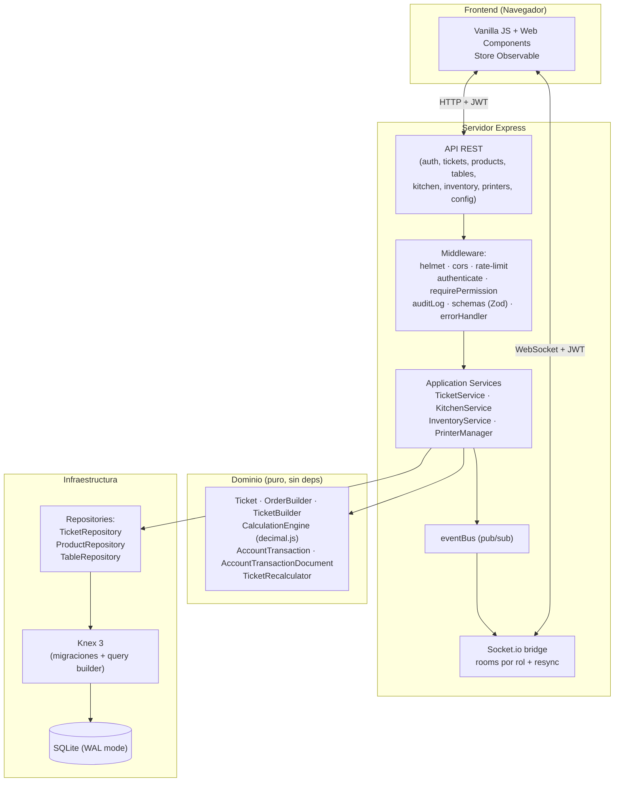

<div align="center">

# SambaPos_LBA

**Sistema POS web profesional — clon funcional de SambaPOS V3**
Construido con Node.js + Express + Knex + SQLite + Socket.io + Vanilla JS

[](https://github.com/Lean031110/Samba_Pos_V3-Web/actions/workflows/ci.yml)
[](./LICENSE)
[](https://nodejs.org/)
[](#pruebas)
[](#seguridad)

</div>

---

SambaPos_LBA es una reimplementación web de **SambaPOS V3** (la versión de
escritorio WPF/C# original de *emreeren*). Conserva el modelo de dominio
(tickets, órdenes, cálculos, ledger de doble entrada, RBAC con 26 permisos,
KDS multi-estación, inventario con recetas, impresión ESC/POS) pero lo
ejecuta sobre un stack moderno y ligero: Node.js + Express + Knex + SQLite
+ Socket.io + Vanilla JS.

> **No es un fork del código WPF.** El código fuente original de SambaPOS V3
> se usó únicamente como referencia funcional para reimplementar las reglas
> de negocio. Ver [Créditos](#créditos).

---

## Capturas de pantalla

| Login | Dashboard |
|:---:|:---:|
|  |  |

| POS — vista vacía | POS — con barra de comandos |
|:---:|:---:|
|  |  |

| Modal de nota | Kitchen Display System (KDS) |
|:---:|:---:|
|  |  |

| WebSocket conectado | Error de login |
|:---:|:---:|
|  |  |

---

## Tabla de contenidos

- [Características](#características)
- [Stack tecnológico](#stack-tecnológico)
- [Arquitectura](#arquitectura)
- [Requisitos](#requisitos)
- [Instalación rápida](#instalación-rápida)
- [Variables de entorno](#variables-de-entorno)
- [Scripts disponibles](#scripts-disponibles)
- [Estructura del proyecto](#estructura-del-proyecto)
- [Pruebas](#pruebas)
- [Seguridad](#seguridad)
- [Despliegue con Docker](#despliegue-con-docker)
- [Roadmap](#roadmap)
- [Documentación](#documentación)
- [Contribuir](#contribuir)
- [Licencia](#licencia)
- [Créditos](#créditos)
- [Estado del proyecto](#estado-del-proyecto)

---

## Características

- **POS completo** — tickets, órdenes, pagos, cálculos, descuentos, regalos,
  *voids*, *refunds*, *splits* y *merges*.
- **KDS multi-estación** con routing, *state machine* de órdenes y propagación
  de *voids* entre estaciones.
- **Inventario y recetas** con deducción transaccional al cerrar el ticket.
- **Impresión real ESC/POS** con transporte TCP, *retry* exponencial y *fallback*.
- **WebSocket** con autenticación JWT, *rooms* por rol y *resync* tras
  reconexión.
- **RBAC granular** con 26 permisos.
- **Auditoría completa** de acciones sensibles (creación/edición de productos,
  cambio de estado de mesas, etc.).
- **Idempotency protection** en operaciones críticas.
- **Migraciones Knex** + *seed* transaccional.
- **Docker multi-stage** con endpoints de *health* y *readiness*.
- **CI/CD** con *gitleaks* (secret scan) + *npm audit* gate antes de correr
  los tests.
- **Suite de pruebas: 165 tests** (138 unit + 27 E2E).
- **Seguridad**: JWT obligatorio (sin *defaults*), bcrypt, *rate-limiting* en
  login, CSP estricto con *helmet*, CORS estricto en producción.

---

## Stack tecnológico

| Capa | Tecnología |
|------|-----------|
| **Backend** | Node.js 20 + Express 5 + Helmet + express-rate-limit |
| **Frontend** | Vanilla JS + Web Components (sin framework, sin virtual DOM) |
| **Base de datos** | SQLite 3.44 (modo WAL) + Knex 3 (migraciones + query builder) |
| **WebSocket** | Socket.io 4 (multi-terminal sync) |
| **Tests** | `node --test` (unit/integration) + Playwright 1.63 (E2E) |
| **DevOps** | Docker multi-stage + GitHub Actions + gitleaks |

---

## Arquitectura

Arquitectura **DDD-lite en capas**: el dominio no tiene dependencias (puro),
la infraestructura lo persiste, la capa de aplicación lo orquesta, y la API
REST lo expone. El `eventBus` (pub/sub interno) reproduce el patrón
`EventAggregator` de PRISM usado en el WPF original, y un puente de
Socket.io lo publica a los clientes conectados por rol.



**Decisiones de diseño clave**:

1. **`CalculationEngine` es el único punto de entrada a `decimal.js`** — ningún
   otro módulo toca la librería directamente. Esto garantiza paridad monetaria
   *byte-a-byte* con el C# original (incluida la mezcla de modos de redondeo
   `ToEven` y `AwayFromZero`).
2. **Ledger de doble entrada** — cada operación monetaria (venta, impuesto,
   descuento, pago, cambio, reembolso) crea o actualiza un
   `AccountTransaction` dentro del `AccountTransactionDocument` del ticket.
3. **Auto-reversal** — `AccountTransaction.UpdateAmount(-amount)` intercambia
   *Source* ↔ *Target* automáticamente (usado para reembolsos).
4. **JSON short DataMember names** — `Ticket.TicketTags`, `Order.Taxes` y
   `Order.OrderStates` se persisten como JSON strings (igual que en el
   SQL CE original).
5. **PRAGMAs SQLite obligatorios** — `foreign_keys=ON`, `defer_foreign_keys=ON`
   en transacciones, `journal_mode=WAL`, `busy_timeout=5000`,
   `synchronous=NORMAL`.

---

## Requisitos

- **Node.js** 20 o superior
- **npm** 10 o superior
- (Opcional) **Docker** + **Docker Compose** para despliegue con un comando

---

## Instalación rápida

```bash
# 1. Clonar el repositorio
git clone https://github.com/Lean031110/Samba_Pos_V3-Web.git
cd Samba_Pos_V3-Web/backend

# 2. Instalar dependencias (reproducible desde package-lock.json)
npm ci

# 3. Copiar variables de entorno y editarlas
cp ../.env.example ../.env
# edit .env — set JWT_SECRET, CORS_ORIGIN, ADMIN_PIN
#   JWT_SECRET=$(openssl rand -hex 32)

# 4. Migraciones (crean data/samba.db con todas las tablas)
npm run migrate

# 5. Seed transaccional (admin user + 19 reglas de cálculo + 4 payment types + ...)
npm run seed

# 6. Levantar el servidor
npm start
```

| URL | Servicio |
|-----|----------|
| http://localhost:3001/ | Frontend (servido como SPA por Express) |
| http://localhost:3001/api | API REST |
| ws://localhost:3001 | WebSocket (multi-terminal sync) |
| http://localhost:3001/health | Healthcheck (HTTP + DB) |

**Login admin:** usuario `Administrator`, PIN = valor de `ADMIN_PIN` en `.env`
(por defecto `1234`).

---

## Variables de entorno

Copia `.env.example` a `.env` y completa los valores. **En producción** todos
los marcados como *requerido* son obligatorios.

| Variable | Requerido | Default | Descripción |
|----------|:---:|---------|-------------|
| `NODE_ENV` | no | `development` | `development`, `production` o `test` |
| `PORT` | no | `3001` | Puerto HTTP + WebSocket |
| `JWT_SECRET` | **sí** | — | Secret para firmar JWT. Mínimo 32 caracteres. Genera con `openssl rand -hex 32`. |
| `JWT_EXPIRES_IN` | no | `8h` | Expiración del token (formato `ms`) |
| `CORS_ORIGIN` | **sí en prod** | `*` (solo dev) | Lista separada por comas de orígenes permitidos. **`*` es rechazado en producción** — el servidor aborta el arranque. |
| `SAMBA_DB_PATH` | no | `data/samba.db` | Ruta de la BD SQLite (relativa al backend o absoluta) |
| `ADMIN_PIN` | **sí (seed)** | `1234` | PIN del admin inicial. *Solo se usa en `npm run seed`*. Se almacena como *bcrypt hash*. |
| `BACKUP_DIR` | no | `data/backups` | Directorio donde se guardan los *snapshots* de backup |

> **Importante:** nunca confirmes `.env` en git. El archivo está en
> `.gitignore` y el CI ejecuta *gitleaks* en cada push.

---

## Scripts disponibles

Ejecutar desde el directorio `backend/`:

| Script | Descripción |
|--------|-------------|
| `npm start` | Inicia el servidor Express + Socket.io |
| `npm run dev` | Modo *watch* (reinicia al guardar) |
| `npm run migrate` | Aplica las migraciones pendientes de Knex |
| `npm run migrate:rollback` | Deshace la última migración |
| `npm run seed` | Ejecuta el *seed* transaccional (admin + datos demo) |
| `npm test` | Tests de integración HTTP (`api-integration.test.js`) |
| `npm run test:sprint2` | Acceptance test del motor de negocio |
| `npm run test:e2e` | E2E del flujo completo (HTTP + WebSocket) |
| `npm run test:playwright` | E2E con navegador real (Playwright + Chromium) |
| `npm run test:print` | Test de checksum ESC/POS (buffer determinista) |
| `npm run backup` | Crea un *snapshot* de la BD |
| `npm run restore` | Restaura el *snapshot* más reciente |

Para correr **toda la suite de un solo comando**:

```bash
bash scripts/run-all-tests.sh
```

---

## Estructura del proyecto

```
Samba_Pos_V3-Web/
├── .env.example                # Template de variables de entorno
├── .gitleaks.toml              # Config de secret scan en CI
├── .github/workflows/ci.yml   # Pipeline: gitleaks + npm audit + tests + docker
├── Dockerfile                  # Imagen multi-stage (Node 20 slim)
├── docker-compose.yml          # Servicio + volumen + healthcheck
├── LICENSE                     # MIT
├── README.md                   # Este archivo
├── CONTRIBUTING.md             # Guía para contribuidores
├── CODE_OF_CONDUCT.md          # Contributor Covenant 2.1
├── CHANGELOG.md                # Historial de versiones
│
├── analysis/                   # Análisis forense del SambaPOS V3 original
│   ├── FULL_ARCHITECTURE_REPORT.md   # 30+ proyectos C# descompuestos
│   ├── DATABASE_SCHEMA_EXACT.sql    # 96 tablas + ER Mermaid
│   ├── UI_SPECS_FOR_WEB.md          # Paleta, tipografía, layouts
│   ├── BUSINESS_RULES_ENGINE.md     # Pseudocódigo 1:1 de los calculadores
│   └── DDL_EXAMPLES_SPRINT1.sql
│
├── backend/
│   ├── package.json
│   ├── playwright.config.js
│   ├── src/
│   │   ├── api/                # Capa de presentación (Express)
│   │   │   ├── server.js
│   │   │   ├── routes/         # auth, tickets, products, tables, kitchen,
│   │   │   │                    # inventory, printers, config
│   │   │   ├── services/       # TicketService, KitchenService,
│   │   │   │                    # InventoryService, PrinterManager
│   │   │   └── middleware/     # auth, rbac, auditLog, schemas (Zod),
│   │   │                        # logger, errorHandler
│   │   ├── application/
│   │   │   └── eventBus.js     # Pub/sub interno (emula PRISM EventAggregator)
│   │   ├── domain/            # Puro, sin dependencias externas
│   │   │   ├── Ticket.js
│   │   │   ├── OrderBuilder.js
│   │   │   ├── TicketBuilder.js
│   │   │   ├── CalculationEngine.js   # Único punto de entrada a decimal.js
│   │   │   ├── TicketRecalculator.js
│   │   │   ├── AccountTransaction.js
│   │   │   └── AccountTransactionDocument.js
│   │   └── infrastructure/
│   │       ├── db/             # Knex config + db.js + migraciones + seeds
│   │       └── repositories/   # TicketRepository, ProductRepository, TableRepository
│   ├── scripts/                # backup, restore, run-migrations, run-all-tests.sh
│   └── tests/
│       ├── api-integration.test.js       # 47 tests
│       ├── kds-verification.test.js       # 49 tests
│       ├── inventory-verification.test.js # 13 tests
│       ├── concurrency-verification.test.js # 8 tests
│       ├── security-verification.test.js  # 21 tests (CORS, auth bypass, fuzzing)
│       └── e2e/                            # Playwright (27 tests)
│           ├── api-isolated.spec.js
│           ├── ui-isolated.spec.js
│           ├── websocket-flow.spec.js
│           └── global-setup.js
│
├── docs/                       # Documentación por módulo
│   ├── BASELINE_REPORT.md
│   ├── PHASE1_REPORT.md
│   ├── PRODUCTION.md
│   ├── KITCHEN.md
│   ├── INVENTORY.md
│   ├── PRINTING.md
│   ├── RBAC.md
│   ├── BACKUP.md
│   ├── OFFLINE.md
│   └── screenshots/            # Capturas de pantalla referenciadas arriba
│
├── frontend/
│   ├── index.html
│   ├── css/                    # variables, reset, layout, components
│   ├── js/
│   │   ├── app.js
│   │   ├── views/              # login, dashboard, pos, payment, kitchen
│   │   ├── services/           # api.js
│   │   ├── store/              # store.js, websocket-client.js
│   │   └── components/         # flex-button.js (Web Component)
│   └── vendor/                 # Font Awesome 6 + socket.io client
│
└── data/                       # SQLite db (NO se commitea — ver .gitignore)
    └── backups/                # Snapshots (también gitignored)
```

---

## Pruebas

El proyecto mantiene **165 tests passing** distribuidos en tres capas:

| Capa | Suite | # Tests | Cómo correrla |
|------|-------|:---:|---------------|
| **Unit / Integration** | `api-integration.test.js` | 47 | `npm test` |
| Unit / Integration | `kds-verification.test.js` | 49 | `node --test tests/kds-verification.test.js` |
| Unit / Integration | `inventory-verification.test.js` | 13 | `node --test tests/inventory-verification.test.js` |
| Unit / Integration | `concurrency-verification.test.js` | 8 | `node --test tests/concurrency-verification.test.js` |
| **Security** | `security-verification.test.js` | 21 | `node --test tests/security-verification.test.js` |
| **E2E (Playwright)** | `api-isolated.spec.js` + `ui-isolated.spec.js` + `websocket-flow.spec.js` | 27 | `npm run test:playwright` |
| **Total** | | **165** | |

### Estrategia de tests

- **Unit tests (`node --test`)** — 138 tests en 5 suites. Cubren el dominio
  (cálculos, ledger de doble entrada, auto-reversal), los servicios de
  aplicación, las rutas REST y la concurrencia. Usan `supertest` + `node:assert`
  sin dependencias externas pesadas.
- **E2E tests (Playwright + Chromium)** — 27 tests en 3 suites. Cubren los
  flujos completos de UI (login → dashboard → POS → nota → pago → cierre),
  la API aislada y los flujos de WebSocket multi-cliente.
- **Security tests** — 21 tests específicos de *hardening*:
  - CORS *hardening* (3): verifica que el server aborta en producción si
    `CORS_ORIGIN='*'`.
  - *Auth bypass* (10): verifica que todas las rutas `/api/*` (excepto
    `/auth/login`) rechazan requests sin JWT válido.
  - *Fuzzing* en login (8): envía payloads maliciosos/malformados al endpoint
    de login para verificar que Zod los rechaza.

### Cómo correr todo

```bash
bash scripts/run-all-tests.sh
```

Este *script* resetea la BD entre suites y reporta el resultado final. El CI
lo replica en cada push a `main` y en cada PR.

---

## Seguridad

La postura de seguridad sigue el principio **fail-secure**:

- **JWT obligatorio** — no hay *defaults* para `JWT_SECRET`. La app aborta el
  arranque si falta o es menor a 32 caracteres.
- **bcrypt obligatorio para PINs** — los PINs nunca se almacenan en texto
  plano; el *seed* los hashea con bcrypt antes de insertarlos.
- **Rate limiting en login** — 5 intentos cada 15 minutos por IP, con
  respuesta 429 estándar.
- **Helmet con CSP estricto** — `Content-Security-Policy`, `X-Content-Type-
  Options`, `X-Frame-Options: DENY`, etc.
- **CORS estricto en producción** — `CORS_ORIGIN='*'` o vacío es rechazado:
  el servidor llama `process.exit(1)` con un mensaje claro antes de abrir
  el socket.
- **RBAC granular** — 26 permisos discretos (`tickets.create`, `tickets.close`,
  `products.edit`, `kitchen.route`, etc.) aplicados vía `requirePermission()`
  en 11 rutas previamente sin RBAC.
- **Auditoría** — cada acción sensible (crear/editar producto, cambiar estado
  de mesa, cerrar ticket, etc.) escribe en `audit_log` con usuario, IP,
  payload y timestamp.
- **Validación de payload con Zod** — 9 *handlers* críticos (`auth.login` +
  8 endpoints de tickets) validan el body con schemas *strict* que rechazan
  claves desconocidas.
- **Idempotency protection** — las operaciones críticas usan claves de
  idempotencia para evitar duplicados por reintento.
- **gitleaks + npm audit gate en CI** — el job `security` corre antes que
  el job `test`. Si gitleaks detecta un secret o `npm audit --audit-level=low`
  reporta vulnerabilidades, el build falla.

> **Estado actual:** 0 vulnerabilidades (`npm audit`), 0 *leaks* (`gitleaks`
> en 31 commits escaneados).

Ver [`docs/PHASE1_REPORT.md`](./docs/PHASE1_REPORT.md) para el detalle
completo del endurecimiento de FASE 1.

---

## Despliegue con Docker

El `Dockerfile` es **multi-stage** (builder con Python + make + g++ para
compilar `sqlite3` nativo; runtime slim con solo `libsqlite3-0`), corre
como usuario no-root, y expone un endpoint `/health` que verifica HTTP + DB.

```bash
# 1. Definir los secrets requeridos
export JWT_SECRET=$(openssl rand -hex 32)
export ADMIN_PIN=1234

# 2. Levantar
docker compose up -d --build

# 3. Verificar
curl http://localhost:3001/health

# 4. (Primer arranque) Sembrar la BD
docker compose exec samba-pos npm run seed

# 5. Detener
docker compose down        # detiene containers (conserva el volumen)
docker compose down -v     # detiene + borra el volumen (¡pierde la BD!)
```

El volumen `samba-data` persiste `/app/data/samba.db` entre reinicios.

---

## Roadmap

El proyecto sigue un plan de 18 fases definido en el *prompt maestro*.
Estado actual:

| Fase | Estado | Descripción |
|------|:---:|-------------|
| FASE 0 | ✅ | Auditoría forense del repositorio original |
| FASE 1 | ✅ | Seguridad y limpieza (este release) |
| FASE 2 | 🚧 | Dominio: agregados faltantes, *idempotency keys*, *state machine* formal |
| FASE 3 | ⏳ | Casos de uso avanzados (splits complejos, voids retroactivos) |
| FASE 4 | ⏳ | Refactor de aplicación y APIs |
| FASE 5 | ⏳ | Módulo de reportes |
| FASE 6 | ⏳ | Panel de administración UI |
| FASE 7 | ⏳ | Limpieza de mocks y deuda técnica |
| FASE 8 | ⏳ | Auditoría y observabilidad |
| FASE 9–18 | ⏳ | PWA, Web Push, Android, PostgreSQL, admin panel, etc. |

Ver [`docs/BASELINE_REPORT.md`](./docs/BASELINE_REPORT.md) y
[`docs/PHASE1_REPORT.md`](./docs/PHASE1_REPORT.md) para el detalle.

---

## Documentación

| Documento | Contenido |
|-----------|-----------|
| [`docs/BASELINE_REPORT.md`](./docs/BASELINE_REPORT.md) | Auditoría inicial del repo (FASE 0): estructura, stack, bugs, deuda técnica |
| [`docs/PHASE1_REPORT.md`](./docs/PHASE1_REPORT.md) | Endurecimiento de seguridad (FASE 1): CORS, RBAC, Zod, gitleaks |
| [`docs/PRODUCTION.md`](./docs/PRODUCTION.md) | Guía de despliegue en producción |
| [`docs/KITCHEN.md`](./docs/KITCHEN.md) | KDS: state machine, routing, void propagation |
| [`docs/INVENTORY.md`](./docs/INVENTORY.md) | Inventario y recetas, deducción transaccional |
| [`docs/PRINTING.md`](./docs/PRINTING.md) | Impresión ESC/POS: transporte TCP, retry, fallback |
| [`docs/RBAC.md`](./docs/RBAC.md) | Los 26 permisos y su mapeo a roles |
| [`docs/BACKUP.md`](./docs/BACKUP.md) | Estrategia de backup/restore |
| [`docs/OFFLINE.md`](./docs/OFFLINE.md) | Modo offline y resync |

---

## Contribuir

¡Las contribuciones son bienvenidas! Por favor leé
[`CONTRIBUTING.md`](./CONTRIBUTING.md) antes de abrir un PR.

En resumen:

1. Haz *fork* del repositorio.
2. Crea una rama (`feat/...`, `fix/...`, `phase-N/...`).
3. Asegúrate de que `bash scripts/run-all-tests.sh` pase y que `npm audit`
   reporte 0 vulnerabilidades.
4. Usa **Conventional Commits** (`feat:`, `fix:`, `docs:`, `test:`, `chore:`,
   `refactor:`, `security:`).
5. Abre un PR contra `main`.

Por favor respeta el [Code of Conduct](./CODE_OF_CONDUCT.md).

---

## Licencia

Este proyecto está licenciado bajo la licencia **MIT**. Ver el archivo
[`LICENSE`](./LICENSE) para el texto completo.

---

## Créditos

**SambaPOS V3** por [emreeren](https://github.com/emreeren/SambaPOS-3) —
el código fuente original (WPF/C#) se usó como referencia funcional para
derivar las reglas de negocio, el esquema de base de datos y el modelo de
dominio.

> **Aclaración importante:** SambaPos_LBA **no es un fork** del código WPF.
> Es una reimplementación web independiente escrita desde cero en
> Node.js + Vanilla JS. No comparte código fuente con el original; sólo
> replica su comportamiento funcional. El nombre "SambaPOS" pertenece a sus
   autores; este proyecto lo usa únicamente con fines de atribución.

---

## Estado del proyecto

**En desarrollo activo.**

- ✅ **FASE 0** — Auditoría forense (completa)
- ✅ **FASE 1** — Seguridad y limpieza (completa, 165/165 tests, 0 vulns)
- 🚧 **FASE 2** — Dominio (en progreso)

Última actualización: 2026-09-07 ·
[v0.4.0](./CHANGELOG.md#unreleased)
