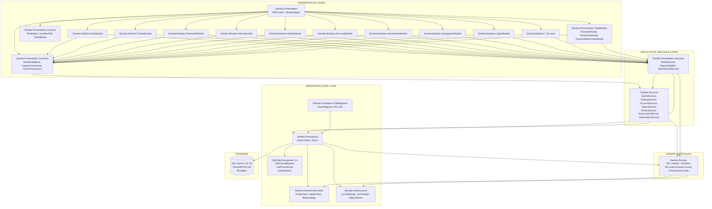

# FULL ARCHITECTURE REPORT — SambaPOS V3

> Forensic analysis of the SambaPOS V3 source code (https://github.com/josephwambura/SambaPOS-3).
> This document drives the WPF → Web migration plan. Every section is sourced from real `.cs` / `.xaml` files in the repository.

**Repo root (in this workspace):** `/home/z/my-project/samba-web-clone/source/`
**Solution file:** `SambaPos.sln` (30+ C# projects, ~550 KB solution file).
**SambaPOS V3 platform:** .NET 4.5 / WPF / Entity Framework 4.4 Code-First / SQL Server CE 4.0 (`.sdf`).
**Default language:** Turkish strings in resources (e.g. `Resources.CanNotAddItemToLockedTicket`); UI default culture is en-US but seed data uses English.

---

## 1. Solution Decomposition (Projects)

SambaPOS V3 is a **modular composite WPF application** built on top of the Microsoft Patterns & Practices **PRISM** library (event aggregation, region manager, module catalog). The solution is organised in **Clean Architecture / DDD-lite** style: a pure domain, infrastructure that knows about EF, application services, and a presentation shell composed of independently-loaded modules.

### 1.1 Project catalogue

| # | Project | Type | Layer | Responsibility |
|---|---------|------|-------|----------------|
| 1 | `Samba.Infrastructure` | ClassLib | Infrastructure (cross-cutting) | `LocalSettings` (global config), `JsonHelper`, `ObjectCloner`, expression parsers (`QuantityFuncParser`, `DateFuncParser`), `Utility`. **NO DB coupling.** |
| 2 | `Samba.Infrastructure.Data` | ClassLib | Infrastructure (persistence primitives) | Abstract base classes: `ValueClass` (Id), `EntityClass` (Id+Name), `AbstractMap` (Terminal/Department/UserRole/TicketType scoping), interfaces `IEntityClass`, `IValueClass`, `IAbstractMapModel`, `ICacheable`, `IOrderable`. |
| 3 | `Samba.Domain` | ClassLib | **Domain (pure POCO, no deps)** | 90+ entity classes across `Tickets`, `Menus`, `Accounts`, `Inventory`, `Settings`, `Users`, `Tasks`, `Entities`, `Automation`. Fluent Builders namespace. **The heart of the system.** |
| 4 | `Samba.Domain.Tests` | UnitTest | Test | MSTest tests for the Domain layer (tax, calculations, builders). |
| 5 | `Samba.Persistance` | ClassLib | Infrastructure (EF) | `DataContext : DbContext` (EF Code-First), `OnModelCreating` mapping, DAO interfaces + implementations (`TicketDao`, `SettingDao`, `AccountDao`, `WorkPeriodDao`, `CacheDao`). |
| 6 | `Samba.Persistance.DBMigration` | ClassLib | Infrastructure (migrations) | FluentMigrator `[Migration(n)]` classes 001–024. Tracks schema evolution. |
| 7 | `Samba.Services` | ClassLib | Application Services | Service interfaces + implementations for **Cache, Settings, Accounts, Menu, Inventory, Reports, Automation, Printer, Expression, Messaging, EMail, Device**. |
| 8 | `Samba.Services.Tests` | UnitTest | Test | Service-layer unit tests. |
| 9 | `Samba.Presentation.Services` | ClassLib | Application Services (Presentation-coupled) | `TicketService`, `PaymentEditor`, `WorkPeriodService`, `UserService`, `EntityServiceClient`, `TaskService`, `TriggerService`, `ReportServiceClient`, `DataCreationService` (seed), `RuleGenerator`. |
| 10 | `Samba.Presentation.Common` | ClassLib | Presentation (shared) | `ViewModelBase` (bindable, INotifyPropertyChanged), `CommandBase` / `CaptionCommand<T>` (delegate commands), `Common.Services` (UI services: `IUserDialog`, `IMessageService`), `ActionProcessors` (automation action implementations), `Widgets`, `ErrorReport`. |
| 11 | `Samba.Presentation.Controls` | ClassLib | Presentation (custom controls) | `FlexButton` (THE touch button — auto-contrasting foreground, glow animation), `NumberPad` (calc-style keypad), `TicketButton` (table tiles), `TicketButtonGroup`, `EditorButton`, `TicketOrdersButton`, `ScrollableText`, `CaptionControl`, `IsPressControl`, `KineticBehaviour` (touch kinetic scrolling), `OfficeTabControl`, `OutlookBar`, `EditableComboBox`. |
| 12 | `Samba.Presentation.ViewModels` | ClassLib | Presentation (ViewModels) | Pure VMs: `PosViewModel` (root ticket VM), `TicketViewModel`, `TicketOrdersViewModel`, `PaymentEditorViewModel`, `MenuItemSelectorViewModel`, `TicketListViewModel`, `NumberPadViewModel`, `AutomationCommandViewModel`. |
| 13 | `Samba.Presentation` | WPF App | Shell | `App.xaml` / `App.xaml.cs`, `Shell.xaml` / `ShellViewModel.cs`, `Common.xaml` (merged resources), `Bootstrapper.cs` (PRISM bootstrap, DI registration), `MainWindow.xaml`. |
| 14 | `Samba.Modules.PosModule` | ClassLib | Module (root POS UI) | `PosView.xaml` (ticket dashboard), `PosViewModel.cs`, ActionProcessors (`CreateTicket`, `AddOrder`, `PayTicket`, `CloseActiveTicket`, `DisplayTicket`, `LocateTicket`, `UpdateTicketState`, `UpdateOrderState`). |
| 15 | `Samba.Modules.TicketModule` | ClassLib | Module (ticket UI) | `TicketView.xaml`, `TicketOrdersView.xaml`, `AutomationCommandSelectorView.xaml`, `TicketNoteEditorView.xaml`, `TicketTagEditorView.xaml`, `TicketTagListView.xaml`, ActionProcessors (`MarkTicketAsClosed`, `CloseTicket`, `LockTicket`, `UnlockTicket`, `MoveSelectedOrders`, `AddOrder`, `UpdateEntity`). |
| 16 | `Samba.Modules.PaymentModule` | ClassLib | Module (payment) | `PaymentEditorView.xaml`, `NumberPadView.xaml`, `ChangePaymentTypeView.xaml`, `PaymentTypeView.xaml`, `TenderedValueView.xaml`, `ReturningAmountView.xaml`, `CommandButtonsView.xaml`, `ForeignCurrencyButtonsView.xaml`, `OrderSelectorView.xaml`. |
| 17 | `Samba.Modules.MenuModule` | ClassLib | Module (menu mgmt) | Menu items, portions, prices, screen menu editor. |
| 18 | `Samba.Modules.ModifierModule` | ClassLib | Module (order tags) | `OrderTagGroupEditorView.xaml`, `OrderTagEditorView.xaml`. |
| 19 | `Samba.Modules.AccountModule` | ClassLib | Module (accounts) | `AccountDetailsView.xaml`, `AccountTransactionView.xaml`, `AccountScreenView.xaml`. |
| 20 | `Samba.Modules.EntityModule` | ClassLib | Module (tables/customers) | `EntityDashboardView.xaml`, `EntitySelectorView.xaml`, `EntitySearchView.xaml`, `EntityScreenView.xaml`. |
| 21 | `Samba.Modules.NavigationModule` | ClassLib | Module (menu navigation) | `NavigationView.xaml`, `NavigationViewModel.cs` (outlook-bar-style tiles). |
| 22 | `Samba.Modules.LoginModule` | ClassLib | Module (login) | `LoginView.xaml`, `LoginPadControl.xaml` (numeric keypad login). |
| 23 | `Samba.Modules.SettingsModule` | ClassLib | Module (settings) | Printer, terminal, work period, foreign currency, automation UI. |
| 24 | `Samba.Modules.ManagementModule` | ClassLib | Module (management dashboard) | `ManagementView.xaml` (Outlook bar with rules, actions, triggers, reports). |
| 25 | `Samba.Modules.AutomationModule` | ClassLib | Module (rules/actions) | `RuleViewModel`, `ActionViewModel`, `ScriptViewModel`, `TriggerViewModel`. |
| 26 | `Samba.Modules.PrinterModule` | ClassLib | Module (printer mgmt) | Printer, printer template, print job editors. |
| 27 | `Samba.Modules.TaskModule` | ClassLib | Module (tasks) | Task card / ticket-like tasks. |
| 28 | `Samba.Modules.WorkperiodModule` | ClassLib | Module (work period) | Start/stop work period UI. |
| 29 | `Samba.Modules.UserModule` | ClassLib | Module (users) | User / role / permission editors. |
| 30 | `Samba.Modules.InventoryModule` | ClassLib | Module (inventory) | Warehouse, inventory items, recipes, periodic consumption. |
| 31 | `Samba.Modules.BasicReports` | ClassLib | Module (reports) | `BasicReportView.xaml`, `ReportView.xaml` — Crystal-style reports. |
| 32 | `Samba.Modules.DepartmentModule` | ClassLib | Module (departments) | Department editor. |
| 33 | `Samba.Modules.MarketModule` | ClassLib | Module (market) | App-store-like integration. |
| 34 | `Samba.Modules.CidMonitor` | ClassLib | Module (caller-ID) | Telephony integration. |
| 35 | `Samba.ApiServer` | ClassLib | API (legacy) | Self-hosted HTTP API (NancyFx-style). |
| 36 | `Samba.MessagingServer` | ConsoleApp | Service | TCP messaging hub between POS terminals. |
| 37 | `Samba.MessagingServer.WindowsService` | WinSvc | Service | Windows Service wrapper for the messaging server. |
| 38 | `Samba.MessagingServerServiceTool` | Tool | Service | Installer tool for the messaging service. |
| 39 | `SambaSetup` | WixProj | Installer | WiX-based MSI installer. |
| 40 | `Lib/EntityFramework.dll` | Binary | Lib | EF 4.4 binary. |
| 41 | `Lib/FluentMigrator.dll` | Binary | Lib | FluentMigrator binary. |
| 42 | `Lib/FluentScript` | Source | Lib | Custom scripting engine used for automation expressions. |
| 43 | `Lib/Stateless` | Source | Lib | State-machine library (referenced but barely used in V3). |

### 1.2 Dependency rules (enforced by project references)

```
Samba.Infrastructure        ← depends on nothing
Samba.Infrastructure.Data   ← Samba.Infrastructure
Samba.Domain                ← Samba.Infrastructure, Samba.Infrastructure.Data, FluentScript, Stateless
Samba.Persistance           ← Samba.Domain, Samba.Infrastructure, Samba.Infrastructure.Data, EntityFramework
Samba.Persistance.DBMigration ← Samba.Persistance, FluentMigrator
Samba.Services              ← Samba.Domain, Samba.Persistance, Samba.Infrastructure
Samba.Presentation.Services ← Samba.Services, Samba.Domain, Samba.Presentation.Common
Samba.Presentation.Common   ← Samba.Domain, Samba.Services
Samba.Presentation.Controls ← (WPF only, no Domain dep)
Samba.Presentation.ViewModels ← Samba.Presentation.Common, Samba.Presentation.Services
Samba.Presentation          ← Samba.Presentation.ViewModels, Samba.Presentation.Controls, Samba.Modules.*
Samba.Modules.*             ← Samba.Presentation.Common, Samba.Presentation.Services, Samba.Presentation.Controls
```

### 1.3 Critical architectural finding

**SambaPOS V3 uses a rich-domain-model, NOT an anemic model.** There are NO standalone `OrderCalculator`, `TaxCalculator`, `TicketTotalCalculator`, `DiscountCalculator` classes. All math is embedded as methods on the entities themselves:

- `Ticket.GetSum()` / `Ticket.Recalculate()` / `Ticket.CalculateServices()` / `Ticket.CalculateTax()` / `Ticket.GetRemainingAmount()`
- `Order.GetTotal()` / `Order.GetValue()` / `Order.GetTaxablePrice()` / `Order.GetTotalTaxAmount()`
- `TaxValue.GetTax()` / `TaxValue.GetTaxAmount()`
- `Calculation.Update()` — THE unified discount/service/rounding engine (5 calculation types in a single method)
- `AccountTransaction.UpdateAmount()` — handles auto-reversal on negative amounts

There are also NO domain service interfaces inside `Samba.Domain`. Service interfaces (`ITicketService`, `IAccountService`, `IInventoryService`, etc.) live in `Samba.Services` and `Samba.Presentation.Services`.

---

## 2. Dependency Graph (Layered)



### 2.1 Communication flow example: "user taps a product button"

```
[FlexButton Click XAML event]
   ↓ bound to ICommand
[MenuItemSelectorViewModel.MenuItemCommand]   (Presentation)
   ↓ publishes EventTopicNames.ScreenMenuItemDataSelected
[PosViewModel.OnMenuItemSelected]              (Presentation)
   ↓ calls
[TicketOrdersViewModel.AddOrder]               (Presentation)
   ↓ calls
[TicketService.AddOrder]                       (Application Service)
   ↓ calls
[Ticket.AddOrder → OrderBuilder.Build]         (Domain)
   ↓ calls
[Order.UpdateMenuItem / UpdatePortion / UpdateTaxTemplates]   (Domain)
   ↓ mutates Order entity
[TicketService.RecalculateTicket]              (Application Service)
   ↓ calls
[Ticket.Recalculate → GetSum → CalculateServices → CalculateTax]   (Domain math)
   ↓ mutates Ticket.TotalAmount / RemainingAmount
[TicketService._applicationState.NotifyEvent]  (Automation)
   ↓ rule engine fires AppRules mapped to "OrderAdded"
[ActionProcessor.Execute]                      (Presentation.Common)
   ↓ may trigger further actions (print, update state, etc.)
[TicketDao.Save]                               (Infrastructure)
   ↓ EF Code-First persists to SQL CE
[SambaPOS3.sdf]                                (Database)
```

---

## 3. Technology Stack Detected

| Layer | Technology | Version | Notes |
|-------|-----------|---------|-------|
| Runtime | .NET Framework | 4.5 (net45) | Verified in `.csproj` files. |
| UI Framework | WPF | 4.5 | XAML + code-behind. |
| Composition | PRISM (likely v4) | — | `EventAggregator`, `IRegionManager`, module catalog inferred from `EventTopicNames` and `IRegion` usage in `Samba.Presentation.Common`. |
| MVVM | Custom (`ViewModelBase`, `CaptionCommand<T>`) | — | No MVVM Light / Caliburn. |
| ORM | Entity Framework | 4.4.0.0 | Code-First (no EDMX). `Lib/EntityFramework.dll`. |
| Migrations | FluentMigrator | — | `Lib/FluentMigrator.dll`, `Lib/FluentMigrator.Runner.dll`. 24 migrations. |
| Database | SQL Server Compact 4.0 | 4.0 | `.sdf` file in `Documents\SambaPOS3\`. Optional full SQL Server. **NOT SQLite.** |
| Logging | Custom `LogService` | — | Logs to a text file in the app data folder. |
| Scripting | FluentScript (custom lib) | — | Used by `Script` entity and `ExpressionService` for automation expressions. |
| State machine | Stateless (lib) | — | Referenced but minimally used. |
| Messaging | Custom TCP server | — | `Samba.MessagingServer` for multi-terminal sync. |
| HTTP API | Self-hosted (`Samba.ApiServer`) | — | Optional REST-ish API. |
| Printing | Microsoft PointOfService + RawPrinter (winspool) | — | ESC/POS for thermal, XPS for Windows printers. |
| Installer | WiX | — | `SambaSetup/SambaSetup.wixproj`. |
| Test framework | MSTest | — | `Microsoft.VisualStudio.QualityTools.UnitTestFramework`. |

---

## 4. Folder & File Layout (Web-Clone Mapping)

The original codebase is **flat** (no `src/` / `test/` split). Below is the recommended mapping to the **/samba-web-clone/** target structure mandated by the user.

| Original (C#) | Web-Clone Target (JS/TS) | Justification |
|---------------|--------------------------|---------------|
| `Samba.Domain/Models/**` | `/backend/src/domain/entities/**` | Pure POCO → ES6 classes or TS interfaces. |
| `Samba.Domain/Builders/**` | `/backend/src/domain/builders/**` | Fluent builders for tests + factories. |
| `Samba.Infrastructure/Settings/LocalSettings.cs` | `/backend/src/domain/LocalSettings.ts` | `Decimals=2`, currency/quantity formats. |
| `Samba.Infrastructure/Helpers/JsonHelper.cs` | `/backend/src/infrastructure/JsonHelper.ts` | Same JSON short-name convention. |
| `Samba.Infrastructure/Data/Serializer/ObjectCloner.cs` | `/backend/src/infrastructure/ObjectCloner.ts` | Deep clone via `structuredClone`. |
| `Samba.Persistance/Data/DataContext.cs` + `OnModelCreating` | `/backend/src/infrastructure/db/schema.sql` + Knex/Prisma migrations | EF Code-First → explicit DDL. |
| `Samba.Persistance/Implementations/*Dao.cs` | `/backend/src/infrastructure/repositories/*Repository.ts` | DAO pattern → Repository pattern. |
| `Samba.Persistance.DBMigration/Migration_*.cs` | `/backend/src/infrastructure/db/migrations/*.{js,ts}` | FluentMigrator → Knex/Umzug. |
| `Samba.Services/**/*Service.cs` | `/backend/src/application/services/*Service.ts` | Application services. |
| `Samba.Presentation.Services/**/*Service.cs` | `/backend/src/application/services/*Service.ts` (UI-coupled ones go to frontend) | Mostly `TicketService`, `PaymentEditor` → frontend store + backend endpoints. |
| `Samba.Presentation.Common/ActionProcessors/**` | `/backend/src/application/actions/**` | Automation action processors. |
| `Samba.Presentation.ViewModels/**` | `/frontend/src/store/**` (Zustand) | VMs → React stores. |
| `Samba.Presentation.Controls/**` | `/frontend/src/components/**` | Custom controls → React components. |
| `Samba.Modules.*/Views/*.xaml` | `/frontend/src/components/screens/*.tsx` | One XAML view → one TSX component. |
| `Samba.Presentation/Shell.xaml` | `/frontend/src/App.tsx` + `/frontend/index.html` | App root. |
| `Samba.Presentation/Common.xaml` | `/frontend/src/styles/tokens.css` + `tailwind.config.js` | Resource dictionaries → CSS variables + Tailwind theme. |
| `Samba.Services/Implementations/PrinterModule/**` | `/frontend/src/services/printer.ts` (PDF) + `/backend/src/services/escpos.ts` (WebUSB/escpos) | Print module split. |

---

## 5. Cross-Cutting Concerns

### 5.1 Caching strategy

`Samba.Services/Implementations/CacheService.cs` is the **in-memory cache** that pre-loads all reference data (MenuItems, TaxTemplates, PaymentTypes, CalculationSelectors, ScreenMenus, EntityTypes, AppRules, AppActions, Printers, PrinterTemplates, TicketTypes, Departments, Terminals) at application startup. **The DB is hit once, then everything is read from memory.** Mutations go through DAOs which update both the DB and the cache.

**Implication for web clone:** For a single-tenant single-terminal replica, an in-memory cache on the backend (or even on the client) is fine. For multi-tenant, the cache must be per-tenant.

### 5.2 Automation engine

The automation system (`Samba.Services/Implementations/AutomationModule/`) is a **rule engine**:

1. **`AppRule`** declares an `EventName` to listen for (e.g. `"TicketCreated"`, `"OrderAdded"`, `"PaymentProcessed"`, `"TicketClosing"`).
2. **`RuleConstraintValue`** predicates are evaluated against the data object (e.g. `{Ticket.TotalAmount} > 100`).
3. **`ActionContainer`** instances run sequentially, each invoking an `AppAction` with parameter values formatted from the data object.
4. **`AppAction.Parameter`** uses `[:PropertyName]` placeholders replaced at runtime.

Built-in action types (in `Samba.Presentation.Common/ActionProcessors/`): `UpdateOrder`, `UpdateTicketStatus`, `UpdateOrderStatus`, `UpdateOrderGiftState`, `UpdateEntityState`, `CreateTicket`, `CloseTicket`, `DisplayPaymentScreen`, `ExecutePrintBillJob`, `ExecuteKitchenOrdersPrintJob`, `LockTicket`, `UnlockTicket`, `MarkTicketAsClosed`, `PayTicket`, `MoveSelectedOrders`, `AddOrder`, `UpdateEntity`, `SetTicketTag`, `UpdateTicketTag`, `SetTicketState`, `UpdateTicketEntityState`, `UpdateProgramSetting`, `SendEmail`, `ExecuteScript`, `LoopbackValues`, `AskQuestion`, `DisplayTicketList`, `SetCurrentDepartment`, `SetTicketType`, etc.

### 5.3 Multi-terminal messaging

`Samba.MessagingServer` is a **TCP hub** (port 8080 by default) that broadcasts `Message` objects between POS terminals. Each `Message` has a string `Topic` (e.g. `"TicketRefreshMessage"`, `"Ping"`, `"EntityRefreshMessage"`) and a payload. Used for cross-terminal ticket table refresh (so terminal A sees terminal B's open tickets).

**Web clone:** Replace with **WebSocket** (`socket.io` or native `ws`). Same topic-based pub/sub model.

### 5.4 Concurrency

`Numerator.LastUpdateTime` is a `byte[]` configured as `IsConcurrencyToken` + `HasColumnType("timestamp")` — EF's optimistic concurrency token. **Every ticket/order number increment is atomic with retry on `DbUpdateConcurrencyException`** (`SettingDao.GetNextNumber` retry loop).

`TicketDao.CheckConcurrency` (called inside `CloseTicket`) compares the in-memory ticket against a fresh DB-loaded copy: if `TicketEntities` count/IDs, `IsClosed`, `LastPaymentDate`, or `GetSum()` (when `RemainingAmount==0`) differ, the close is rejected with `"TicketPaidLastChangesNotSaved"`.

**Web clone:** Use Postgres `UPDATE ... WHERE last_updated_at = $1` returning pattern, or Knex `FOR UPDATE` row locks.

---

## 6. Key Findings & Risks for Web Migration

### 6.1 Things that translate cleanly

| Original | Web equivalent | Effort |
|----------|---------------|--------|
| `Samba.Domain` entities (POCO) | TypeScript interfaces + classes | Low — mechanical translation. |
| `OrderBuilder` / `TicketBuilder` (fluent) | Same fluent API in TS | Low. |
| `TaxValue.GetTax` / `Calculation.Update` | Same math, `decimal.js` instead of `decimal` | Low — math is pure. |
| DAO pattern | Repository pattern | Low. |
| `CacheService` | Module-level cache or Redis | Low. |
| PRISM EventAggregator | Custom EventEmitter or RxJS | Low. |
| `FlexButton` control | `<Button>` React component with same CSS | Medium. |

### 6.2 Things that DO NOT translate directly

| Original | Issue | Mitigation |
|----------|-------|------------|
| **WPF XAML layout** (Grid with `Width="*"`) | CSS Grid / Flexbox have different sizing semantics | Carefully convert each Grid → CSS Grid with `grid-template-columns: ...fr`. |
| **WPF Resource Dictionaries** (brushes, styles) | No direct equivalent | Map to CSS custom properties + Tailwind theme. |
| **`Microsoft.PointOfService` + RawPrinterHelper** (winspool.Drv P/Invoke) | Browser cannot print raw bytes directly | Use **WebUSB** for ESC/POS, or `window.print()` with a hidden iframe of formatted HTML. |
| **SQL Server CE `.sdf`** | No portable JS driver | **Switch to SQLite (better-sqlite3) or Postgres.** Schema is portable (nvarchar→TEXT, datetime→TIMESTAMP, decimal→NUMERIC). |
| **WPF Storyboards** (animations) | CSS transitions / keyframes | Re-animate `Silver→Gainsboro` etc. as CSS transitions. |
| **`KineticBehaviour.HandleKineticScrolling`** (touch kinetic scroll) | iScroll / native `-webkit-overflow-scrolling: touch` | Use native CSS touch scrolling. |
| **`Microsoft Win32` P/Invoke** (cash drawer, raw print) | Browser sandbox | WebUSB / Web Serial API (Chrome only) or backend-side print service. |
| **PRISM Module Catalog** (dynamic loading) | Webpack code splitting | Lazy-load route components. |
| **`EntityFramework.CodeFirst` conventions** (shadow FK columns like `AccountTransactionType_Id`) | Prisma/Knex require explicit columns | Make all FKs explicit (rename `_Id` → `Id`). |
| **`Stateless` library** (state machines) | XState or custom | Mostly used loosely — could be inline state fields. |
| **`FluentScript`** (custom scripting for automation) | JS `eval` or `vm2` sandbox | Re-implement with `Function` constructor + restricted scope. |

### 6.3 Critical rounding-mode inconsistency to preserve

SambaPOS V3 uses **two different rounding modes** depending on the code path:

| Code path | Mode | Source |
|-----------|------|--------|
| `Ticket.CalculateTax` | `decimal.Round(value, 2)` (defaults to `MidpointRounding.ToEven` / banker's rounding) | `Ticket.cs:350` |
| `Ticket.CalculateServices` | `decimal.Round(value, 2)` (banker's) | `Ticket.cs:376` |
| `Ticket.GetTaxTotal` | `decimal.Round(value, 2, MidpointRounding.AwayFromZero)` (schoolbook) | `Ticket.cs:694, 700` |
| `AccountTransaction.UpdateAmount` | `Decimal.Round(Amount, 2, MidpointRounding.AwayFromZero)` | `AccountTransaction.cs:203` |
| `TaxValue.GetTax` (per-line, when `Rounding>0`) | `decimal.Round(..., Rounding, MidpointRounding.AwayFromZero)` | `TaxValue.cs:47` |
| `Calculation.Update` type 4 (rounding) | `decimal.Round(currentSum / Amount, MidpointRounding.AwayFromZero)` | `Calculation.cs:45` |
| `ProductTimerValue.GetPrice` | `decimal.Round(..., LocalSettings.Decimals)` (banker's) | `ProductTimerValue.cs:32` |

**Web clone MUST preserve this inconsistency** for byte-perfect monetary parity with the original. JavaScript `Math.round` rounds half-up (toward +∞ for `.5`), which matches `AwayFromZero` for positives but NOT for negatives. Use:

```javascript
const roundBankers = (v, d=2) => { const f = Math.pow(10, d); const n = v * f; return Math.round(n % 1 === 0.5 || n % 1 === -0.5 ? Math.sign(n) * Math.floor(Math.abs(n)) : n) / f; };
const roundAwayFromZero = (v, d=2) => { const f = Math.pow(10, d); return Math.sign(v) * Math.round(Math.abs(v) * f) / f; };
```

Or just use `decimal.js` with explicit `rounding` modes.

### 6.4 JSON field short-name convention

`Ticket.TicketTags`, `Ticket.TicketStates`, `Ticket.TicketLogs`, `Order.Taxes`, `Order.OrderTags`, `Order.OrderStates`, `Task.CustomData`, `Entity.CustomData`, `EntityStateValue.EntityStates`, `AccountScreen.AutomationCommandMapData`, `AppRule.RuleConstraints`, `AppAction.Parameter`, `Widget.Properties`, `ScreenMenuItem.OrderTags/OrderStates/AutomationCommand` are all JSON strings persisted in DB columns. The DataContract serializer uses **short `[DataMember(Name="XX")]` names** (e.g. `"TN"`, `"TV"`, `"TR"`, `"RN"`) for compactness.

**Web clone must replicate the exact JSON wire format** if reading/writing existing `.sdf` files; otherwise can use full property names with a migration adapter.

### 6.5 Seed data is mandatory for parity

The seed (`Samba.Presentation.Services/Common/DataGeneration/DataCreationService.cs`) creates a fully-working POS at first launch: 1 admin user (PIN `1234`), 5 account types, 7 accounts (Sales, Receivables, Cash, Credit Card, Voucher, Discount, Rounding), 7 account transaction types, 2 calculation types (Discount, Round), 4 payment types (Cash/Credit/Voucher/Customer Account), 2 entity types (Customers, Tables), 1 department (Restaurant), 1 warehouse, 3 printers, 3 printer templates, 2 print jobs, 9 automation commands, 13 actions, 19+ rules. **The web clone MUST replicate this seed** for behavioural parity.

---

## 7. Glossary

- **Ticket** = order ticket / table check / receipt.
- **Order** = a single line item on a ticket (NOT a purchase order). Same as "TicketItem" in other POS systems.
- **Calculation** = a discount, service charge, rounding, or manual adjustment applied to a ticket. The `CalculationType` int (0–5) picks the math.
- **OrderTag** = a modifier on an order (e.g. "Extra Cheese", "No Onions"). Belongs to an `OrderTagGroup`.
- **TicketTag** = a free-form or pre-defined tag on a ticket (e.g. "Dine-in", "Takeaway").
- **TicketEntity** = a link between a ticket and an Entity (table, customer, etc.).
- **Entity** = a generic business object — typically a Table or a Customer. Defined by its `EntityType`.
- **AccountTransaction** = a double-entry ledger movement (source → target, debit/credit on each side).
- **WorkPeriod** = a shift / day boundary. Reports are scoped to work periods.
- **Terminal** = a POS terminal registration (used for multi-terminal config scoping).
- **Department** = a context that bundles a TicketType + Warehouse + ScreenMenu + PriceTag.
- **Numerator** = a sequential number generator for ticket/order numbers.
- **ScreenMenu** = the POS product button layout (categories → items → buttons).

---

**End of FULL_ARCHITECTURE_REPORT.md** — source for `/samba-web-clone/analysis/FULL_ARCHITECTURE_REPORT.md`.
